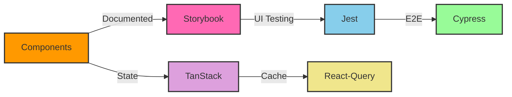
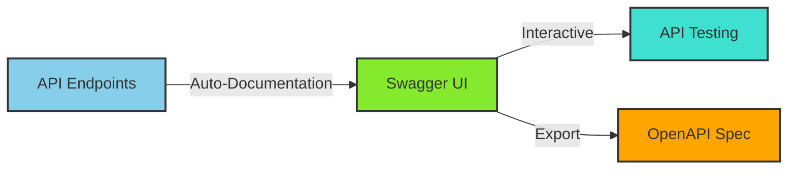
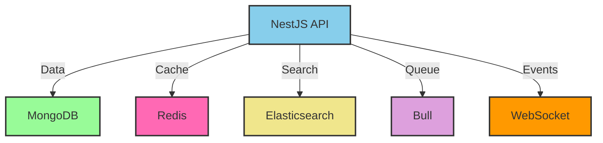
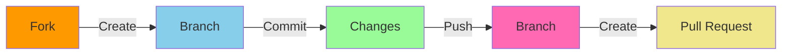

# 🚀 Math-IA's

<div align="center">

　
　
　
　
　


<br>
<br>

[](https://choosealicense.com/licenses/mit/)
[](https://github.com/username/math-ias/issues)
[](https://github.com/username/math-ias)

</div>

<div align="center">

<br>

```txt
██╗    ██╗███████╗██╗      ██████╗ ██████╗ ███╗   ███╗███████╗    ████████╗ ██████╗ 
██║    ██║██╔════╝██║     ██╔════╝██╔═══██╗████╗ ████║██╔════╝    ╚══██╔══╝██╔═══██╗
██║ █╗ ██║█████╗  ██║     ██║     ██║   ██║██╔████╔██║█████╗         ██║   ██║   ██║
██║███╗██║██╔══╝  ██║     ██║     ██║   ██║██║╚██╔╝██║██╔══╝         ██║   ██║   ██║
╚███╔███╔╝███████╗███████╗╚██████╗╚██████╔╝██║ ╚═╝ ██║███████╗       ██║   ╚██████╔╝
 ╚══╝╚══╝ ╚══════╝╚══════╝ ╚═════╝ ╚═════╝ ╚═╝     ╚═╝╚══════╝       ╚═╝    ╚═════╝ 
███╗   ███╗ █████╗ ████████╗██╗  ██╗      ██╗ █████╗ ███████╗
████╗ ████║██╔══██╗╚══██╔══╝██║  ██║      ██║██╔══██╗██╔════╝
██╔████╔██║███████║   ██║   ███████║█████╗██║███████║███████╗
██║╚██╔╝██║██╔══██║   ██║   ██╔══██║╚════╝██║██╔══██║╚════██║
██║ ╚═╝ ██║██║  ██║   ██║   ██║  ██║      ██║██║  ██║███████║
╚═╝     ╚═╝╚═╝  ╚═╝   ╚═╝   ╚═╝  ╚═╝      ╚═╝╚═╝  ╚═╝╚══════╝
```

</div>

<div align="center">

> 🌟 _"Transformando el aprendizaje del cálculo con Inteligencia Artificial"_ 🌟

</div>

<div align="center">

<br>

[](https://github.com/username/math-ias/actions/workflows/deploy.yml)
[](https://sonarcloud.io/dashboard?id=username_math-ias)
[](https://sonarcloud.io/dashboard?id=username_math-ias)
[](https://sonarcloud.io/dashboard?id=username_math-ias)

<br>

[📘 Documentación](docs/README.md) • [🚀 Demo en Vivo](https://math-ias.com) • [🐛 Reportar Bug](issues/new) • [✨ Solicitar Feature](issues/new)

<br>

</div>

---

<details>
<summary>📋 Tabla de Contenidos</summary>

- [✨ Características](#-características)
- [🛠️ Stack Tecnológico](#️-stack-tecnológico)
- [🏗️ Arquitectura](#️-arquitectura)
- [🚀 Inicio Rápido](#-inicio-rápido)
- [📚 Documentación](#-documentación)
- [🧪 Testing](#-testing)
- [🤝 Contribución](#-contribución)
- [📞 Soporte](#-soporte)
- [📄 Licencia](#-licencia)

</details>

## ✨ Características

<div align="center">

<table>
<tr>
<td align="center" width="33%">

<br>
<b>Análisis Inteligente</b>
<br>
IA que analiza y adapta el contenido
</td>
<td align="center" width="33%">

<br>
<b>Contenido Dinámico</b>
<br>
Ejercicios adaptativos y personalizados
</td>
<td align="center" width="33%">

<br>
<b>Análisis en Tiempo Real</b>
<br>
Seguimiento detallado del progreso
</td>
</tr>
</table>

</div>

## 🎯 Estado del Proyecto

<div align="center">

| Ambiente | Estado | Cobertura | Calidad |
|----------|--------|-----------|----------|
| Producción |  |  |  |
| Desarrollo |  |  |  |

</div>

## 🛠️ Stack Tecnológico

<div align="center">

<table>
<tr>
<td align="center">

<br>TypeScript</td>
<td align="center">

<br>NestJS</td>
<td align="center">

<br>Next.js</td>
<td align="center">

<br>MongoDB</td>
<td align="center">

<br>Swagger</td>
<td align="center">

<br>Docker</td>
<td align="center">

<br>Storybook</td>
<br></td>
</tr>
</table>

</div>

### Frontend
<div align="center">



</div>

### 📚 Documentación API con Swagger

<div align="center">



</div>

#### 🔍 Características de la Documentación API

<div align="center">

| Característica | Descripción |
|---------------|-------------|
| 🚀 API Explorer | Prueba endpoints directamente desde el navegador |
| 📝 OpenAPI 3.0 | Especificación completa de la API |
| 🔐 Auth Integration | Soporte para JWT y otros métodos de autenticación |
| 💻 Code Samples | Ejemplos de código en múltiples lenguajes |
| 🌐 Multiple Environments | Configuraciones para dev, staging y producción |

</div>

#### 📌 Acceso a la Documentación

```bash
# Documentación en desarrollo
http://localhost:3001/api/docs

# Documentación en producción
https://api.math-ias.com/docs
```

<div align="center">

| Ambiente | URL | Estado |
|----------|-----|--------|
| Desarrollo | `localhost:3001/api/docs` |  |
| Staging | `staging-api.math-ias.com/docs` |  |
| Producción | `api.math-ias.com/docs` |  |

</div>

### Backend
<div align="center">



</div>

## 🚀 Inicio Rápido

<div align="center">

<table>
<tr>
<td>

### 🐳 Con Docker

```bash
# Clonar repositorio
git clone https://github.com/username/math-ias

# Navegar al directorio
cd math-ias

# Iniciar con Docker
docker-compose up -d
```

</td>
<td>

### 💻 Desarrollo Local

```bash
# Instalar dependencias
npm install

# Configurar ambiente
cp .env.example .env

# Iniciar desarrollo
npm run dev
```

</td>
</tr>
</table>

</div>

## 📚 Documentación

<div align="center">

<table>
<tr>
<td align="center" width="33%">
<h3>🎨 Storybook</h3>
<a href="https://storybook.math-ias.com">

</a>
<br>
Documentación de componentes
</td>
<td align="center" width="33%">
<h3>📖 API Docs</h3>
<a href="https://api.math-ias.com/docs">

</a>
<br>
Documentación de API
</td>
<td align="center" width="33%">
<h3>📋 Wiki</h3>
<a href="https://wiki.math-ias.com">

</a>
<br>
Wiki del proyecto
</td>
</tr>
</table>

</div>

## 🧪 Testing

<div align="center">

| Tipo | Comando | Cobertura |
|------|---------|-----------|
| Unit Testing | `npm run test` |  |
| Integration | `npm run test:e2e` |  |
| Component | `npm run test:components` |  |

</div>

## 🤝 Contribución

<div align="center">



</div>

### 📋 Guía de Contribución

<details>
<summary>Ver detalles</summary>

1. Fork del repositorio
2. Crear rama (`git checkout -b feature/AmazingFeature`)
3. Commit cambios (`git commit -m 'Add: AmazingFeature'`)
4. Push a la rama (`git push origin feature/AmazingFeature`)
5. Abrir Pull Request

</details>

## 📞 Soporte

<div align="center">

| Canal | Link |
|-------|------|
| 📧 Email | [soporte@math-ias.com](mailto:soporte@math-ias.com) |
| 💬