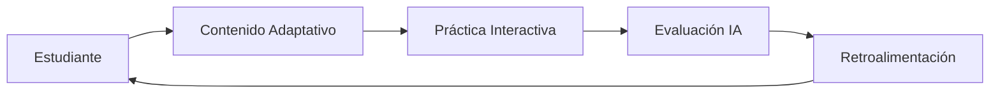
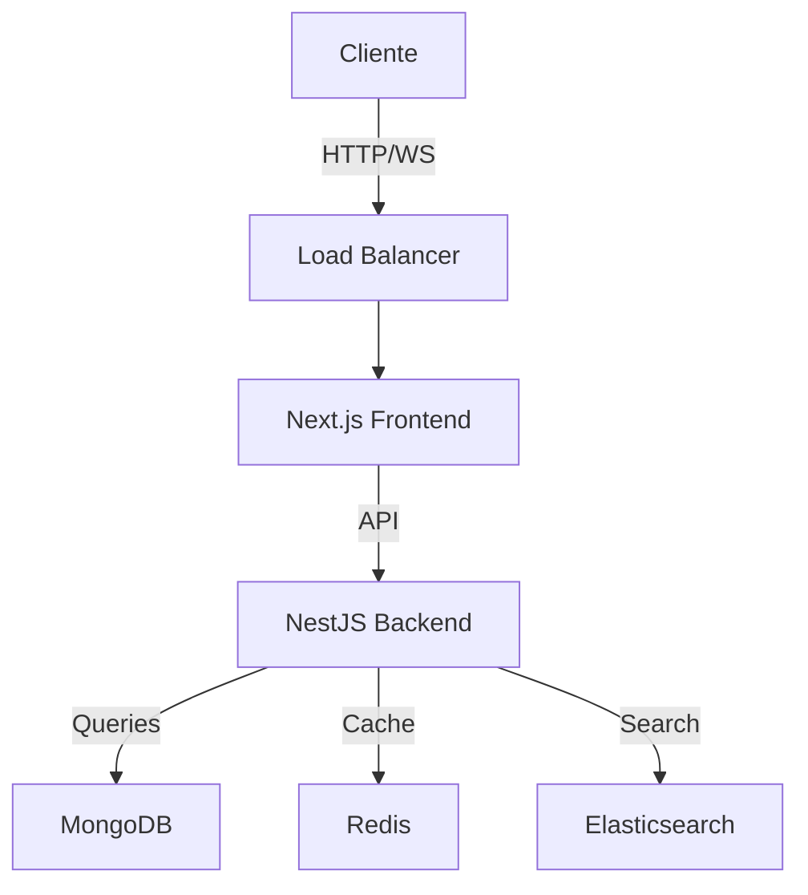
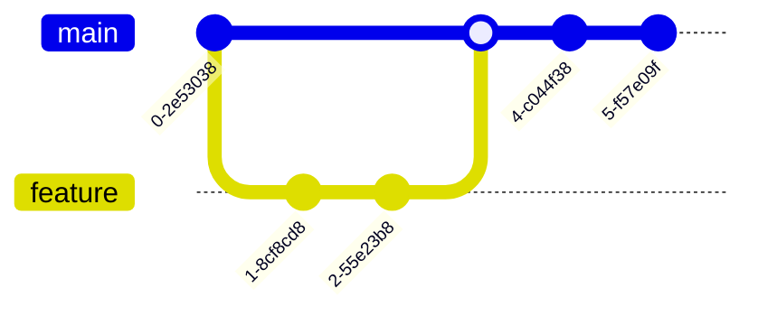

# Math-IA's 🧮 

<div align="center">


---

<p align="center">
  <a href="#"></a>
  <a href="#"></a>
  <a href="#"></a>
</p>

<p align="center">
  <a href="#"></a>
  <a href="#"></a>
  <a href="#"></a>
</p>

<p align="center">
  <a href="#"></a>
  <a href="#"></a>
</p>

</div>

<div align="center">

```diff
+ Plataforma de Aprendizaje Inteligente de Cálculo con IA 🤖
! Versión Actual: 1.0.0-beta
# Estado: En Desarrollo Activo
```

</div>

<div align="center">

|  💻 Requisitos Mínimos   | 🚀 Tecnologías Principales | 🛠️ Herramientas de Desarrollo |
|------------------------|-------------------------|----------------------------|
| Node.js >= 18         | NestJS                 | Docker                    |
| MongoDB >= 7.0        | Next.js                | Postman                   |
| Docker >= 24.0        | TanStack Query         | Notion                    |
| RAM >= 4GB            | JWT Authentication     | Git                       |

</div>

## 🎯 Visión General

Math-IA's revoluciona el aprendizaje del cálculo combinando la potencia de la IA con pedagogía moderna. Nuestra plataforma ofrece:

<div align="center">



</div>

### ✨ Características Destacadas

<div align="center">

| 🤖 IA | 📊 Visualización | 🎯 Aprendizaje | 🤝 Colaboración |
|------|-----------------|---------------|----------------|
| Tutor Virtual | Gráficas 3D | Ejercicios Adaptativos | Foros en Tiempo Real |
| Análisis de Errores | Animaciones | Rutas Personalizadas | Grupos de Estudio |
| Sugerencias Smart | Manipulación Interactiva | Evaluación Continua | Tutoría P2P |

</div>

## 🚀 Inicio Rápido

<div align="center">

```bash
# 🔨 Instalación en un paso
docker-compose up -d
```

</div>

<details>
<summary>📝 Configuración Detallada</summary>

```bash
# 1. Clonar repositorio
git clone https://github.com/tu-usuario/math-ias.git

# 2. Configurar ambiente
cp .env.example .env

# 3. Instalar dependencias
npm install

# 4. Iniciar servicios
docker-compose up -d

# 5. Ejecutar migraciones
npm run migrations
```

</details>

## 📚 Stack Tecnológico Detallado

<div align="center">

| Backend | Frontend | DevOps | Herramientas |
|---------|----------|---------|--------------|
|  |  |  |  |
|  |  |  |  |
|  |  |  |  |

</div>

## 🏗️ Arquitectura

<div align="center">



</div>

## 📊 Estructura del Proyecto

<div align="center">

```plaintext
math-ias/
├── 📂 backend/               # API NestJS
│   ├── 📂 src/              # Código fuente
│   │   ├── 📂 modules/      # Módulos
│   │   ├── 📂 common/       # Utilidades
│   │   └── 📂 config/       # Configuración
├── 📂 frontend/             # App Next.js
│   ├── 📂 src/             
│   │   ├── 📂 components/   # Componentes
│   │   ├── 📂 pages/       # Páginas
│   │   └── 📂 hooks/       # Hooks
└── 📂 docker/              # Config Docker
```

</div>

## 🔄 CI/CD

<div align="center">

| Ambiente | Branch | Deploy | Status |
|----------|--------|---------|---------|
| 🧪 Dev | `develop` | Auto | []() |
| 🚦 Stage | `staging` | Manual | []() |
| 🚀 Prod | `main` | Manual | []() |

</div>

## 📈 Estado del Proyecto

<div align="center">

| Métrica | Estado |
|---------|--------|
| Cobertura de Tests |  |
| Build Status |  |
| Dependencies |  |
| Code Quality |  |

</div>

## 📖 Documentación

<div align="center">

| Recurso | URL |
|---------|-----|
| 📚 API Docs | `http://localhost:3001/docs` |
| 📝 Wiki | [Project Wiki](https://notion.com/math-ias) |
| 🎥 Demos | [Video Tutorials](https://youtube.com) |

</div>

## 🤝 Contribución

<div align="center">



</div>

## 📞 Contacto

<div align="center">

| Canal | Link |
|-------|------|
| 📧 Email | [desarrollo@math-ias.com](mailto:desarrollo@math-ias.com) |
| 💬 Discord | [Servidor Math-IA's](https://discord.gg/math-ias) |
| 🐦 Twitter | [@math_ias](https://twitter.com/math_ias) |

</div>

## 📄 Licencia

<div align="center">

MIT © [Math-IA's Team](LICENSE)

</div>